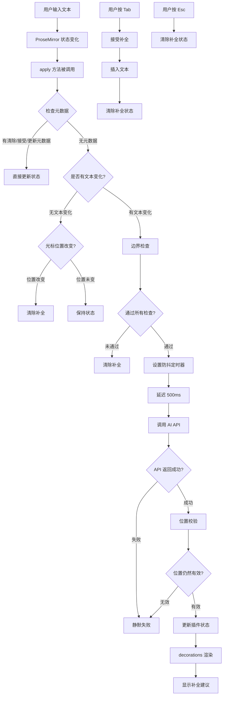
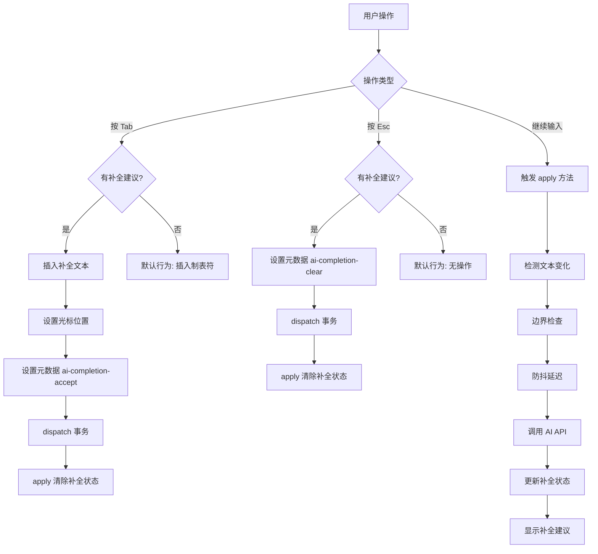

# 在 Markdown 编辑器中实现 AI Tab 补全功能

## 一、项目背景与问题（1-2分钟）

大家好，我今天要讲的是如何在 Markdown 编辑器中实现类似 GitHub Copilot 的 AI Tab 补全功能。

我们希望当用户在编辑器中输入文本时，系统能够自动提取光标前的文本作为上下文，调用 AI API 生成补全建议，然后以灰色斜体文本的形式显示在光标位置。用户可以通过 Tab 键接受补全，Esc 键取消，或者继续输入时自动清除建议。

这个功能看起来简单，但实际上有几个核心挑战：

- 第一个问题是**非侵入式显示**。补全建议不能直接写入文档，否则会影响撤销栈，产生数据污染。比如用户不接受补全，但补全已经写入文档了，撤销起来就很麻烦
- 第二个问题是**实时响应**。需要监听用户输入，及时触发补全请求，但又不能太频繁导致 API 调用过多
- 第三个问题是**异步竞态处理**。AI API 调用是异步的，用户可能在 API 返回前继续输入，这时候补全建议可能显示在错误的位置
- 第四个问题是**位置同步**。要确保补全建议始终显示在正确的光标位置

---

## 二、解决方案演进（2-3分钟）

### 难点1：最初的两次尝试为什么失败了？

最开始，我想的是在编辑器上方叠加一个透明的 DOM 层，通过绝对定位来显示补全建议。

这个方案听起来简单，但实现起来问题很多。比如用户输入 `123|45`，光标在中间，我需要精确计算光标在编辑器中的像素位置。这需要获取光标所在行的 DOM 元素，计算光标前文本的宽度，还要考虑字体、字号、行高、字符宽度等等。更麻烦的是，不同浏览器、不同字体的渲染差异会导致计算不准确。所以这个方案虽然思路简单，但实现复杂，维护成本高，而且难以处理各种边界情况。

既然叠加层不行，我就想，那直接把补全建议插入到文档中，用户不接受时执行撤销操作，不就行了吗？

这个方案听起来更简单，但问题更严重。第一个问题是撤销栈污染，每次补全都会产生一次 Undo 记录，用户需要按多次 Ctrl+Z 才能撤销。第二个问题是数据污染，如果补全插入后用户直接关闭页面，再打开时无法区分是用户输入还是 AI 补全。比如用户输入 `Hello|`，AI 补全插入 `Hello, world!`，用户未接受直接关闭页面，下次打开时文档中留下了 `Hello, world!`，用户可能误以为自己输入的。

所以这两个方案都不行。

### 思路转变：从 VSCode 学到的虚拟文本机制

本来想看下 Cursor 怎么实现的，但是 Cursor 不开源，我就去看了 VSCode 的实现。

VSCode 中的补全建议是灰色的、半透明的，不会影响文档内容，只有按 Tab 确认后才会写入。这种实现方式完美解决了我们遇到的问题。

在 VSCode 中，无论是 AI 补全（GitHub Copilot）还是传统的代码提示补全，都通过**虚拟文本**机制实现。虚拟文本是一种**不实际写入文档、仅在编辑器界面渲染显示**的文本内容。它有三个核心特性：

- **非侵入性**：虚拟文本不会被保存到文件中，不会占用真实的文档字符位置，只是编辑器在界面上的"视觉层叠加"
- **动态绑定**：虚拟文本和光标位置、代码上下文绑定，会随着光标移动、代码修改实时更新或消失
- **样式区分**：通过半透明、浅灰色等样式，区分真实代码和预览内容

VSCode 虚拟文本的实现，核心基于**编辑器的分层渲染架构**和**文本模型与视图分离**的设计理念。VSCode 的编辑器内核基于 Monaco Editor，核心设计是**模型-视图分离**。模型层存储真实文档内容，包括字符、行数、偏移量等，文件的读写、保存、编译都基于这个层。视图层将模型层内容渲染到屏幕上，处理光标位置、滚动、高亮等视觉交互。**关键点是虚拟文本只存在于视图层，不会被写入模型层**，这意味着它只是"看起来存在"，但在编辑器的底层数据结构里没有对应的字符记录。

通过学习 VSCode 的实现原理，我认识到：必须使用非侵入式渲染，补全建议不能写入文档模型；需要装饰器/装饰机制，在视图层叠加显示，不影响文档结构；需要事件监听，实时响应输入、光标移动等操作；需要状态管理，管理补全建议的内容、位置、显示状态。

---

## 三、技术选型与核心原理（2-3分钟）

### 为什么选择 ProseMirror？

我们的编辑器基于 Tiptap，而 Tiptap 是基于 ProseMirror 的富文本编辑器框架。ProseMirror 恰好提供了我们需要的所有能力：

- **Decoration 机制**：可以在视图层叠加显示内容，不修改文档结构（类似 VSCode 的虚拟文本）
- **Plugin 系统**：可以监听文档变化，管理自己的状态
- **事务元数据**：可以通过元数据在不同阶段传递信息，避免循环触发

ProseMirror 是一个用于构建富文本编辑器的工具包，由 Marijn Haverbeke（CodeMirror 的作者）开发。它的核心架构包括：

**文档模型**：基于 JSON 的树形结构，不可变设计，支持撤销/重做。

**事务机制**：所有文档变化都通过事务进行，可以携带元数据，通过 dispatch 应用变化，支持插件拦截和修改。

**插件系统**：可以监听文档变化，可以修改事务，可以管理自己的状态，可以添加装饰。

**Decoration**：这是 ProseMirror 提供的核心 API，用于在文档上叠加视觉元素，不改变文档结构。Decoration 不修改文档模型，只在视图层渲染，可以绑定到文档的特定位置。

比如创建一个装饰，可以这样写：

```typescript
import { Decoration, DecorationSet } from "@tiptap/pm/view";

// 创建装饰，在指定位置显示自定义元素
const decoration = Decoration.widget(position, widgetElement, {
  side: 1, // 在位置之后显示
});

// 创建装饰集
const decorations = DecorationSet.create(doc, [decoration]);
```

这样就能在视图层叠加显示内容，而不修改文档结构。

### 事务元数据的概念

在 ProseMirror 中，所有文档变化都通过**事务（Transaction）**进行。事务不仅可以描述文档的变化（插入、删除文本等），还可以携带**元数据（Meta）**。

元数据的作用是在事务中传递额外的信息，不改变文档内容。插件可以通过 `tr.getMeta(key)` 读取元数据，也可以通过 `tr.setMeta(key, value)` 设置元数据。

在我的实现中：

- 用户按 Tab 接受补全时，设置 `ai-completion-accept` 元数据
- 用户按 Esc 取消补全时，设置 `ai-completion-clear` 元数据
- AI API 返回补全建议时，设置 `ai-completion-update` 元数据
- 插件在 `apply` 方法中读取这些元数据，更新补全状态

这样设计的好处是**避免循环触发**。如果补全更新直接修改文档，会触发新的 `apply` 调用，可能导致无限循环。通过元数据传递信息，可以明确区分"用户输入"和"补全更新"。

---

## 四、具体实现与技术难点（3-4分钟）

### 整体架构

基于 ProseMirror 的插件系统，我实现了 AI 补全扩展。整个流程是这样的：



简单来说就是：用户输入文本后，触发 `apply` 方法，检查元数据，如果没有元数据就检查文本变化，通过边界检查后设置防抖定时器，延迟 500ms 后调用 AI API，API 返回后进行位置校验，校验通过后更新插件状态，`decorations` 方法渲染补全建议，显示在光标位置。

用户按 Tab 时，接受补全，插入文本，清除补全状态。用户按 Esc 时，清除补全状态。

### 难点2：如何实现防抖和异步竞态防护？

那我是怎么解决防抖和异步竞态的问题呢？

**第一是防抖机制**。用户快速输入时，避免频繁调用 AI API。每次新输入都会取消之前的请求，只处理最后一次输入。

```typescript
// 在闭包中保存定时器引用
let debounceTimer: NodeJS.Timeout | null = null;

// 每次新输入时清除之前的定时器
if (debounceTimer) {
  clearTimeout(debounceTimer);
  debounceTimer = null;
}

// 设置新的定时器，延迟 500ms 后调用 AI API
debounceTimer = setTimeout(async () => {
  // AI API 调用逻辑
}, 500);
```

这样就能确保用户快速输入时，只处理最后一次输入，避免频繁 API 调用。

**第二是双重位置校验**。AI API 调用是异步的，用户可能在 API 返回前继续输入。我设计了双重位置校验：防抖回调执行时校验一次，API 返回后再校验一次，确保补全建议只显示在正确的位置，防止异步竞态。

### 难点3：光标位置同步怎么处理？

虚拟文本不应该让光标"跳"过去，用户输入时虚拟文本应该直接消失。

我的解决方案是：在 `decorations` 方法中校验光标位置，位置不一致时不显示装饰。在 `apply` 方法中检测文本变化，如果有文本变化且不是补全相关操作，则清除补全。

```typescript
decorations(state) {
  const pluginState = pluginKey.getState(state);

  // 检查是否有补全建议
  if (!pluginState.suggestion || pluginState.position === null) {
    return DecorationSet.empty;
  }

  // 校验位置有效性：如果光标已移动，不显示补全
  const { selection } = state;
  if (selection.from !== pluginState.position) {
    return DecorationSet.empty;
  }

  // 创建装饰，显示补全建议
  const widget = document.createElement("span");
  widget.style.cssText =
    "color: #9ca3af; " +
    "font-style: italic; " +
    "pointer-events: none; " +
    "user-select: none;";
  widget.textContent = pluginState.suggestion;

  return DecorationSet.create(state.doc, [
    Decoration.widget(pluginState.position, widget, {
      side: 1,  // 在光标后显示
      ignoreSelection: true  // 不影响选择
    })
  ]);
}
```

这样设计的好处是：虚拟文本不会让光标"跳"过去，用户输入时虚拟文本会直接消失，用户体验非常流畅。

### 难点4：边界情况处理

我还处理了以下边界情况：

| 场景     | 处理方式               |
| -------- | ---------------------- |
| 选中状态 | 有文本选择时清除补全   |
| 代码块   | 代码块内不显示文本补全 |
| 文本长度 | 文本太短时不触发补全   |
| 撤销重做 | 通过事务元数据同步状态 |

### 用户交互流程

用户交互的流程是这样的：



简单来说，用户按 Tab 时，如果有补全建议就插入文本并清除状态，如果没有就执行默认行为。用户按 Esc 时，如果有补全建议就清除，如果没有就无操作。用户继续输入时，触发 `apply` 方法，经过边界检查和防抖延迟后调用 AI API，更新补全状态并显示。

### 性能优化

在性能方面，我做了以下优化：

1. **防抖机制**：减少 API 调用次数，延迟 500ms 避免频繁请求
2. **位置校验**：避免无效的状态更新
3. **边界检查**：提前过滤不需要补全的场景，比如代码块、选中状态等
4. **静默失败**：API 错误不影响用户编辑体验，不会弹出错误提示

---

## 五、项目成果（1分钟）

经过这次实现，取得了以下成果：

**功能完整性方面**：

- 实现了类似 GitHub Copilot 的 AI Tab 补全体验
- 支持 Tab 接受、Esc 取消、继续输入自动清除三种交互方式
- 补全建议以灰色斜体显示，与正文内容视觉区分明显

**用户体验方面**：

- 补全建议不影响文档内容，不污染撤销栈
- 响应及时，防抖延迟控制在 500ms，用户几乎感知不到延迟
- 光标位置同步准确，不会出现补全建议"跳位"的情况

**代码质量方面**：

- 基于 ProseMirror 插件系统，架构清晰
- 使用事务元数据传递状态，避免循环触发
- 核心逻辑约 200 行代码，可维护性强

### 与 VSCode 的对比

| 维度          | VSCode                 | ProseMirror 实现           |
| ------------- | ---------------------- | -------------------------- |
| 虚拟文本机制  | Monaco Editor 原生支持 | 通过 Decoration 实现       |
| 模型-视图分离 | 完全分离               | 耦合较紧，但可通过插件解耦 |
| 实现复杂度    | 相对简单（API 完善）   | 需要处理更多边界情况       |
| 性能          | 视图层直接渲染，性能好 | 需要重新计算文档，性能略低 |
| 功能完整性    | 支持所有场景           | 需要逐步完善边界情况       |

### 未来优化方向

1. **性能优化**：大文档时的渲染性能优化
2. **边界情况**：完善 IME 输入法、移动端等场景的处理
3. **用户体验**：支持自定义快捷键、补全建议的样式定制
4. **功能扩展**：支持多行补全、代码块内的补全等

---

## 六、可能的追问与回答

### Q1：为什么选择 ProseMirror 的 Decoration 而不是其他方案？

我选择 Decoration 是因为它最符合"显示但不写入"的需求。

首先它是 ProseMirror 原生提供的能力，不需要额外引入依赖。其次 Decoration 只存在于视图层，不会影响文档模型，完美符合非侵入式渲染的要求。最后 Decoration 支持绑定到文档的特定位置，可以跟随光标移动自动调整。

相比 DOM 叠加层方案，Decoration 不需要手动计算像素位置，不受字体、浏览器差异影响；相比直接插入文本方案，Decoration 不会污染撤销栈和文档内容。

### Q2：防抖时间为什么选择 500ms？

500ms 是一个经过权衡的值。

太短（比如 100ms）会导致用户还在输入时就触发 API 请求，浪费资源。太长（比如 1000ms）会让用户觉得响应慢，体验不好。

500ms 刚好是用户输入一个词或短语的间隔，在这个时间点触发补全，既不会太频繁，也不会让用户等太久。实际项目中可以根据用户反馈调整这个值。

### Q3：如何处理 AI API 调用失败的情况？

我采用的是静默失败策略。

如果 API 调用失败，不显示任何错误提示，也不显示补全建议，用户可以继续正常编辑。这样设计的原因是：AI 补全只是辅助功能，不是核心功能，不应该因为补全失败而干扰用户的编辑体验。

当然，在开发环境下会在控制台打印错误日志，方便调试。

### Q4：这个方案的适用场景有哪些？

这个方案适用于以下场景：

✅ **适合的场景**：Markdown 编辑器、富文本编辑器、代码编辑器（基于 ProseMirror/CodeMirror）、需要 AI 辅助写作的场景。

❌ **不适合的场景**：纯文本输入框（input/textarea，这种场景可以用更简单的 DOM 方案）、实时协作编辑器（需要处理多人光标同步）、移动端（键盘交互方式不同）。

### Q5：如果要支持多行补全，需要做哪些修改？

多行补全需要修改几个地方：

1. **Decoration 渲染**：当前是创建一个 span 元素，多行补全需要创建多个元素或使用 pre 标签保留换行
2. **位置计算**：需要考虑多行文本插入后光标的最终位置
3. **样式处理**：多行补全的样式需要特殊处理，比如缩进、行高等

核心逻辑不需要大改，主要是渲染层的调整。

---

## 七、STAR法则总结（备用，适合简历）

**Situation（背景）**：在 Markdown 编辑器中需要实现类似 GitHub Copilot 的 AI Tab 补全功能，直接插入文本会污染撤销栈和文档内容，DOM 叠加层方案难以处理光标定位。

**Task（任务）**：设计并实现一个非侵入式的 AI 补全功能，在视图层显示补全建议而不修改文档模型，同时处理防抖、异步竞态、位置同步等技术难点。

**Action（行动）**：

1. 研究 VSCode 的虚拟文本实现原理，理解模型-视图分离的设计理念
2. 基于 ProseMirror 的 Decoration 机制实现虚拟文本显示
3. 设计事务元数据传递机制，避免状态更新循环触发
4. 实现 500ms 防抖机制，减少 API 调用频率
5. 设计双重位置校验，解决异步竞态问题
6. 处理边界情况：选中状态、代码块、文本长度、撤销重做等

**Result（结果）**：

- 实现了类似 GitHub Copilot 的流畅补全体验
- 补全建议不影响文档内容，不污染撤销栈
- 核心逻辑约 200 行代码，架构清晰，可维护性强
- 响应及时，用户体验良好

---

整个流程通过 `apply` 方法的状态更新逻辑和 `decorations` 方法的渲染逻辑，实现了从用户输入到补全建议显示的完整闭环。虽然实现过程中需要处理不少边界情况，但最终实现了类似 VSCode 的虚拟文本效果，为 Markdown 编辑器提供了良好的 AI 补全体验。

以上就是我对这个项目的介绍，谢谢大家！
