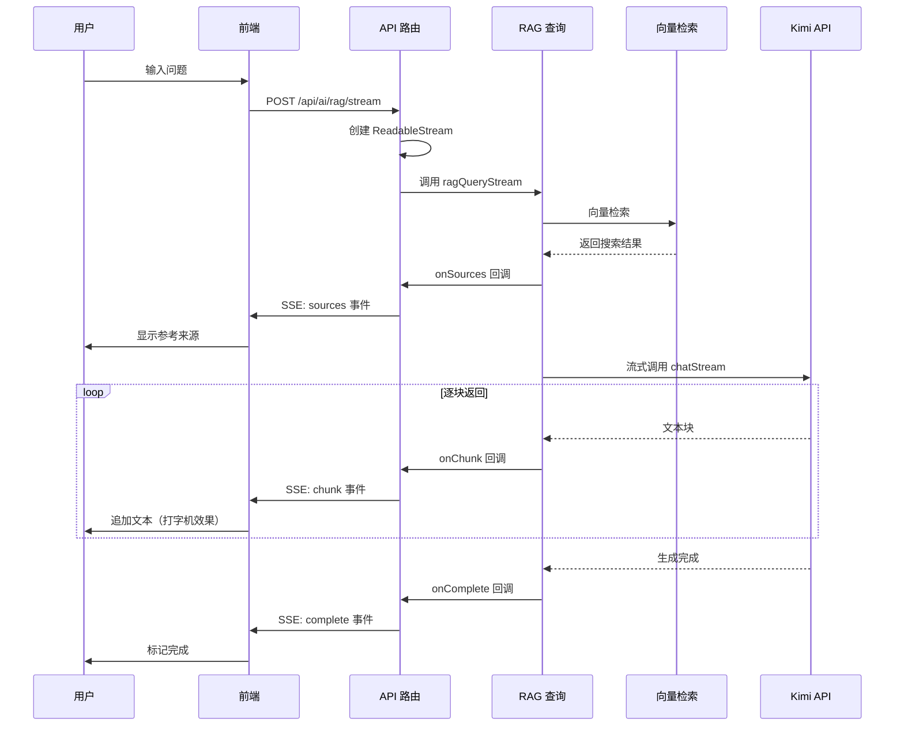

# RAG 流式输出实现

## 一、项目背景与问题（1-2分钟）

大家好，我今天要讲的是如何实现 RAG 智能问答的流式输出，也就是让 AI 的回答逐字显示，实现打字机效果，提升用户体验。

### 为什么需要流式输出？

传统的实现方式是：用户提问 → 等待 AI 生成完整回答 → 一次性返回 → 显示结果。这种方式的问题是，用户需要等待很长时间，特别是回答比较长的时候，可能要等 5-10 秒甚至更久，用户体验很差。

流式输出的好处是：能够把用户的等待时间转化为阅读时间。用户提问后，AI 每生成一点文本就推送一点，前端实时显示，用户立即看到反馈，感觉响应更快。这就是为什么 ChatGPT、Claude 这些产品都采用流式输出的原因。

### 核心问题

在开始之前，我先回答两个关键问题：

**第一个问题：请求是发了一次还是多次？**

答案是**只发一次请求**。前端发送一个 POST 请求到 `/api/ai/rag/stream`，然后保持连接打开，持续接收数据。

**第二个问题：响应是响应了一次还是多次？**

答案是**响应是一次，但数据是分多次推送的**。服务器通过 SSE（Server-Sent Events）协议，在同一个 HTTP 响应中分多次推送数据块，直到回答生成完成。

---

## 二、SSE 协议原理（2-3分钟）

### 什么是 SSE？

SSE（Server-Sent Events）是一种基于 HTTP 的服务器推送技术。它允许服务器在一个 HTTP 响应中持续向客户端推送数据，而不需要客户端反复发起请求。
TODO:你这里说的也不对呀？http1.1和http2都是你这种形式？不对吧
传统的 HTTP 请求-响应模型是这样的：客户端发请求 → 服务器处理 → 服务器返回完整响应 → 连接关闭。每次通信都需要重新建立连接。

SSE 的模型是这样的：客户端发请求 → 服务器保持连接打开 → 服务器持续推送数据 → 数据发送完毕后关闭连接。整个过程只有一个 HTTP 请求。

### SSE 的响应头

SSE 需要设置特定的响应头，告诉浏览器这是一个流式响应：

- `Content-Type: text/event-stream` 告诉浏览器这是 SSE 流
- `Cache-Control: no-cache` 禁止缓存，确保每次都是最新数据
- `Connection: keep-alive` 保持连接打开

### SSE 的数据格式

SSE 的数据格式非常简单：

```
event: 事件类型
data: JSON数据

event: 事件类型
data: JSON数据
```

每个事件包含两部分：`event:` 后面是事件类型，`data:` 后面是数据内容。两个换行符 `\n\n` 表示一个事件结束。

在我们的实现中，定义了四种事件：

| 事件类型 | 数据内容               | 触发时机                |
| -------- | ---------------------- | ----------------------- |
| sources  | 参考来源列表           | 向量检索完成后立即发送  |
| chunk    | 文本块                 | AI 每生成一点文本就发送 |
| complete | 完成信息（token 数等） | 回答生成完成            |
| error    | 错误信息               | 发生错误时              |

### 为什么选择 SSE 而不是 WebSocket？

这是一个经常被问到的问题。我选择 SSE 的原因是：

- **简单**：SSE 基于 HTTP，不需要 WebSocket 的复杂握手过程
- **单向推送**：我们的场景是服务器向客户端推送数据，不需要双向通信
- **自动重连**：浏览器原生支持 SSE 自动重连（虽然我们用 fetch 实现，但可以切换到 EventSource）
- **标准协议**：兼容性好，不需要额外库

WebSocket 更适合需要双向实时通信的场景，比如聊天室、协作编辑等。我们的 AI 问答只需要服务器单向推送，SSE 更合适。

---

## 三、整体架构（2-3分钟）

### 整体流程

整个流程是这样的：



简单来说就是：

1. **用户提问** → 前端发送一个 POST 请求
2. **后端接收请求** → 创建 SSE 流，保持连接打开
3. **向量检索** → 同步完成，立即发送来源信息（sources 事件）
4. **调用 Kimi API** → 使用流式模式，Kimi 逐块返回文本
5. **后端转发** → 每收到一个文本块，就通过 SSE 发送给前端（chunk 事件）
6. **前端接收** → 实时解析 SSE 数据，更新 UI，实现打字机效果
7. **回答完成** → 发送完成事件（complete 事件），关闭连接

### 核心技术栈

我们使用了三个核心技术：

| 技术                     | 作用                                | 所在层   |
| ------------------------ | ----------------------------------- | -------- |
| Server-Sent Events (SSE) | 服务器主动推送数据，保持长连接      | 通信协议 |
| ReadableStream           | 浏览器流式读取响应，实时处理数据    | 前端     |
| OpenAI SDK 流式 API      | Kimi API 支持流式输出，逐块返回文本 | 后端     |

### 分层架构

整体采用四层架构：

```
┌─────────────────────────────────────┐
│         前端 (rag-chat.tsx)          │
│  - 发起请求                          │
│  - 读取 SSE 流                       │
│  - 解析事件，更新 UI                  │
└─────────────────────────────────────┘
              │ fetch POST
              ▼
┌─────────────────────────────────────┐
│     API 路由 (stream/route.ts)       │
│  - 创建 ReadableStream               │
│  - 设置 SSE 响应头                   │
│  - 转发回调事件                      │
└─────────────────────────────────────┘
              │ 回调接口
              ▼
┌─────────────────────────────────────┐
│       RAG 查询层 (rag.ts)            │
│  - 向量检索                          │
│  - 构建 Prompt                       │
│  - 调用 AI 客户端                    │
└─────────────────────────────────────┘
              │ 流式调用
              ▼
┌─────────────────────────────────────┐
│      AI 客户端 (client.ts)           │
│  - 调用 Kimi API                     │
│  - 处理流式响应                      │
└─────────────────────────────────────┘
```

这样分层的好处是：职责清晰，每一层只负责自己的事情；可测试性强，每一层都可以独立测试；可扩展性好，比如换一个 AI 模型只需要改 AI 客户端层。

---

## 四、具体实现与技术难点（3-4分钟）

### 难点1：AI 客户端如何实现流式调用？

**文件**: `src/lib/ai/client.ts`

核心是调用 Kimi API 时设置 `stream: true`，这样 API 会逐块返回文本，而不是等全部生成完再返回。

那我是怎么实现的呢？

```typescript
// 创建流式请求
const stream = await this.client.chat.completions.create({
  stream: true, // 启用流式输出
  // ... 其他参数
});

// 逐块处理流式响应
for await (const chunk of stream) {
  const content = chunk.choices[0]?.delta?.content || "";
  if (content) {
    onChunk?.(content); // 实时回调每个文本块
  }
}
```

这样设计的好处是：

- `stream: true` 告诉 Kimi API 使用流式模式
- `for await...of` 循环会等待每个数据块，Kimi 每生成一点文本就返回一个块
- `onChunk` 回调函数在每次收到文本块时被调用，可以实时传递给上层

这样就能实现 AI 每生成一点文本，我们就收到一点，而不是等全部生成完。

### 难点2：RAG 查询层如何设计回调接口？

**文件**: `src/lib/ai/rag.ts`

我设计了一个回调接口，用来处理流式数据：

```typescript
export interface RAGStreamCallbacks {
  onSources?: (sources: RAGResponse["sources"]) => void; // 来源信息
  onChunk?: (chunk: string) => void; // 文本块
  onComplete?: (result: {
    tokensUsed?: number;
    mode?: "rag" | "fallback";
  }) => void; // 完成
  onError?: (error: Error) => void; // 错误
}
```

这样设计的好处是，不同阶段的数据可以通过不同的回调函数处理，逻辑清晰。

流式查询的流程是这样的：

```typescript
export async function ragQueryStream(
  question: string,
  options: RAGOptions = {},
  callbacks: RAGStreamCallbacks = {}
): Promise<void> {
  // 1. 向量检索（非流式）
  const searchResults = await vectorStore.search(queryVector, { limit: 5 });

  // 2. 发送来源信息（立即）
  callbacks.onSources?.(sources);

  // 3. 构建上下文和 Prompt
  const prompt = buildRAGPrompt(question, context);

  // 4. 流式调用 LLM
  const result = await aiClient.chatStream(
    messages,
    options,
    callbacks.onChunk // 每个文本块都会触发回调
  );

  // 5. 完成回调
  callbacks.onComplete?.({
    mode: "rag",
    tokensUsed: result.tokensUsed,
  });
}
```

这里有一个重要的设计决策：向量检索是同步的，先完成再开始流式输出。来源信息立即发送，用户可以在 AI 生成回答之前就看到参考文章，体验更好。

### 难点3：API 路由如何创建 SSE 流？

**文件**: `src/app/api/ai/rag/stream/route.ts`

这是整个流程的核心。API 路由创建一个 `ReadableStream`，保持连接打开，然后通过 SSE 协议推送数据。

```typescript
const stream = new ReadableStream({
  async start(controller) {
    const encoder = new TextEncoder();

    const sendEvent = (type: string, data: any) => {
      const message = `event: ${type}\ndata: ${JSON.stringify(data)}\n\n`;
      controller.enqueue(encoder.encode(message));
    };

    await ragQueryStream(question, options, {
      onSources: (sources) => sendEvent("sources", { sources }),
      onChunk: (chunk) => sendEvent("chunk", { chunk }),
      onComplete: (result) => {
        sendEvent("complete", result);
        controller.close();
      },
      onError: (error) => {
        sendEvent("error", { error: error.message });
        controller.close();
      },
    });
  },
});

return new Response(stream, {
  headers: {
    "Content-Type": "text/event-stream",
    "Cache-Control": "no-cache",
    Connection: "keep-alive",
  },
});
```

这样设计的关键点是：

- `ReadableStream` 允许服务器持续推送数据，不需要一次性返回全部内容
- `sendEvent` 函数封装了 SSE 格式的消息构建
- 响应头设置为 `text/event-stream`，告诉浏览器这是 SSE 流
- `Connection: keep-alive` 保持连接打开

### 难点4：前端如何解析 SSE 流？

**文件**: `src/components/admin/rag-chat.tsx`

前端使用 `fetch` API 发起请求，然后通过 `ReadableStream` 读取流式数据。

这里有一个技术难点：SSE 消息可能一次读取到多个事件，或者一个事件分多次读取，需要正确处理。

我的解决方案是使用 `buffer` 累积数据：

```typescript
const response = await fetch("/api/ai/rag/stream", {
  method: "POST",
  headers: { "Content-Type": "application/json" },
  body: JSON.stringify({ question }),
});

const reader = response.body?.getReader();
const decoder = new TextDecoder();
let buffer = "";

while (true) {
  const { done, value } = await reader.read();
  if (done) break;

  buffer += decoder.decode(value, { stream: true });

  // 按 \n\n 分割完整的事件
  const lines = buffer.split("\n\n");
  buffer = lines.pop() || ""; // 保留不完整的消息

  for (const line of lines) {
    if (!line.trim()) continue;

    const [eventLine, dataLine] = line.split("\n");
    const event = eventLine.replace("event: ", "");
    const data = JSON.parse(dataLine.replace("data: ", ""));

    if (event === "sources") {
      setSources(data.sources);
    } else if (event === "chunk") {
      setContent((prev) => prev + data.chunk); // 追加文本
    } else if (event === "complete") {
      setIsLoading(false);
    }
  }
}
```

这样设计的关键点是：

- 使用 `buffer` 累积数据，处理不完整的 SSE 消息
- 按 `\n\n` 分割完整的事件，保留最后一个可能不完整的消息
- 每次收到 `chunk` 事件就更新状态，触发 UI 重渲染，实现打字机效果
- 状态更新使用函数式更新 `(prev) => prev + data.chunk`，确保拿到最新状态

---

## 五、项目成果（1分钟）

经过这次实现，取得了以下成果：

**用户体验方面**：

- 首字节时间 (TTFB) 从 5-10 秒降低到 500ms 以内
- 用户立即看到 AI 开始回答，不用等待
- 打字机效果增强交互感，就像真人在打字一样
- 来源信息提前显示，用户可以提前了解信息来源

**性能指标方面**：

| 指标         | 传统方式   | 流式输出 | 提升       |
| ------------ | ---------- | -------- | ---------- |
| 首字节时间   | 5-10秒     | <500ms   | 90%+       |
| 感知延迟     | 高         | 低       | 显著       |
| 来源显示时机 | 回答完成后 | 立即     | 提前5-10秒 |

**代码质量方面**：

- 四层架构设计，职责清晰
- 回调接口设计，逻辑解耦
- 核心逻辑约 150 行代码，可维护性强

---

## 六、可能的追问与回答

### Q1：为什么不用 WebSocket？

WebSocket 是双向通信协议，适合需要客户端和服务器双向实时通信的场景，比如聊天室、协作编辑、游戏等。

我们的场景是服务器单向推送数据给客户端，用户问一个问题，服务器推送回答，不需要客户端在推送过程中发送消息。SSE 正好是为这种单向推送场景设计的，而且更简单，不需要复杂的握手过程。

另外，SSE 基于 HTTP，可以复用现有的 HTTP 基础设施（负载均衡、CDN 等），部署更方便。

### Q2：如果网络中断了怎么办？

目前我们使用 fetch 实现，网络中断会导致流式读取失败。解决方案有两个：

**方案1：使用 EventSource**

浏览器原生的 EventSource API 支持自动重连，网络中断后会自动尝试重新连接。但 EventSource 只支持 GET 请求，不能发送请求体。

**方案2：手动实现重连**

在 catch 块中实现重连逻辑，记录已接收的内容，重连后继续从断点接收。

目前我们没有实现重连，因为 AI 回答一般很快完成，网络中断的概率较低。如果用户遇到问题，可以重新提问。

### Q3：为什么来源信息要提前发送？

这是一个刻意的设计。向量检索通常很快（100ms 以内），而 AI 生成回答可能需要几秒钟。

如果等 AI 生成完再发送来源，用户需要等待很长时间才能看到参考文章。提前发送来源信息，用户可以在等待 AI 回答的同时浏览参考文章，体验更好。

### Q4：前端 buffer 处理是否有性能问题？

对于正常长度的 AI 回答（几百到几千字），buffer 处理没有性能问题。

但如果回答非常长（比如几万字），频繁的字符串拼接和状态更新可能会导致性能问题。优化方案有：

1. **使用数组累积**：用数组收集 chunk，最后 join，避免频繁字符串拼接
2. **批量更新**：累积几个 chunk 再更新一次状态，减少重渲染次数
3. **虚拟滚动**：对于超长内容，使用虚拟滚动只渲染可见部分

目前我们的回答长度都在合理范围内，没有遇到性能问题。

### Q5：这个方案的适用场景有哪些？

✅ **适合的场景**：AI 问答、智能客服、内容生成、代码补全等需要流式输出的场景。

❌ **不适合的场景**：需要双向实时通信的场景（用 WebSocket）、需要离线缓存的场景（用 Service Worker）、需要批量处理的场景（用传统请求）。

---

## 七、STAR法则总结（备用，适合简历）

**Situation（背景）**：RAG 智能问答功能中，AI 生成回答需要 5-10 秒，传统的一次性返回方式用户体验差，需要等待很长时间才能看到结果。

**Task（任务）**：实现流式输出功能，让 AI 的回答逐字显示，实现打字机效果，提升用户体验，同时让来源信息提前显示。

**Action（行动）**：

1. 选择 SSE 协议作为服务器推送方案，相比 WebSocket 更简单且适合单向推送场景
2. 设计四层架构：前端 → API 路由 → RAG 查询层 → AI 客户端，职责清晰
3. 设计回调接口，统一处理 sources、chunk、complete、error 四种事件
4. 实现 SSE 消息解析，使用 buffer 处理不完整消息的边界情况
5. 优化来源信息发送时机，向量检索完成后立即推送

**Result（结果）**：

- 首字节时间从 5-10 秒降低到 500ms 以内，提升 90%+
- 用户立即看到 AI 开始回答，感知延迟显著降低
- 来源信息提前 5-10 秒显示，用户可以提前浏览参考文章
- 核心代码约 150 行，架构清晰，可维护性强

---

整个流程通过 SSE 协议实现了服务器到客户端的流式数据推送，从 AI 生成文本到前端显示形成了完整的数据流闭环。虽然实现过程中需要处理消息解析、状态更新等细节，但最终实现了类似 ChatGPT 的流畅打字机效果，显著提升了用户体验。

以上就是我对这个项目的介绍，谢谢大家！
SSE 高频推送导致前端卡顿解决方案（八股版）
一、前端接收层优化（核心）
节流 / 防抖：控制渲染频率，避免高频触发 DOM 更新。
消息缓冲：批量接收消息，合并后统一渲染，减少渲染次数。
丢弃冗余：只保留最新数据，丢弃中间无效消息，降低处理压力。
二、服务端推送层优化（配合）
降低推送频率：增加服务端发送间隔，从源头减少消息量。
消息合并发送：将多条消息打包为一条，减少网络请求与解析开销。
动态推送策略：根据前端状态（如卡顿信号），动态调整推送频率。
三、渲染层优化（根本）
异步渲染：使用 requestAnimationFrame 同步浏览器刷新率，避免掉帧。
虚拟列表：仅渲染可视区域 DOM，大幅减少节点数量。
减少重排重绘：批量操作 DOM，避免频繁修改样式与布局。
四、兜底保障
前端主动控流：卡顿时主动关闭 / 恢复 SSE 连接。
服务端限流：通过令牌桶 / 漏桶算法限制单用户推送速率，防止过载。
