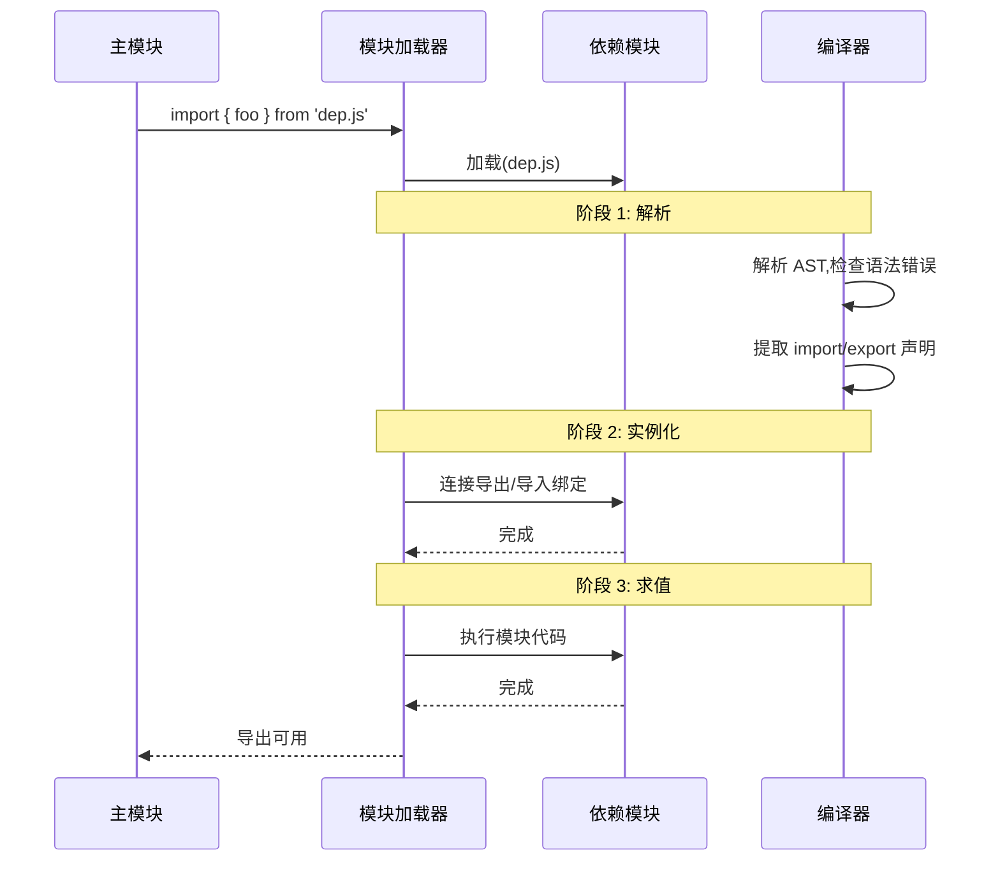

JavaScript 的模块化之路走得并不顺。从早期全局作用域的混乱,到社区驱动的 CommonJS 和 AMD,再到如今成为标准的 ES Modules,这条路上充满了权衡、妥协和创新。

这篇文章我想聊聊 JavaScript 模块化的演进历史,深入理解每个阶段的核心思想和解决的问题,最后重点讲解 ES Modules 的实现原理和最佳实践。

## 为什么需要模块化

在 JavaScript 早期设计中,并没有模块的概念。所有脚本都运行在全局作用域中,这带来了一系列问题:

### 全局作用域的混乱

假设我们在页面中引入多个第三方库:

```html
<script src="jquery.js"></script>
<script src="underscore.js"></script>
<script src="app.js"></script>
```

每个脚本都会向全局作用域添加变量:

```javascript
// jquery.js
var $ = function (selector) {
  /* ... */
};

// underscore.js
var _ = {
  /* ... */
};

// app.js
var currentUser = { name: "Alice" };

// 问题是:任何地方都可以修改这些全局变量
$ = null; // 💥 jQuery 被破坏了
_ = "oops"; // 💥 Underscore 被覆盖了
```

**核心问题:**

1. **命名冲突** - 多个库可能使用相同的全局变量名
2. **依赖管理混乱** - 必须手动按正确顺序加载脚本
3. **无法静态分析** - 工具无法确定代码间的依赖关系
4. **作用域污染** - 所有变量都暴露在全局

### 早期的解决方案

#### 1. IIFE (立即执行函数表达式)

利用函数作用域来隔离变量:

```javascript
// utils.js
var Utils = (function () {
  // 私有变量,外部无法访问
  var privateVar = "secret";

  function privateHelper() {
    // ...
  }

  // 公开 API
  return {
    format: function (str) {
      return str.trim();
    },
    log: function (msg) {
      console.log(privateVar + ": " + msg);
    },
  };
})();

// 使用
Utils.format("  hello  "); // 'hello'
Utils.privateVar; // undefined
```

**优点:**

- 创建了私有作用域
- 通过返回值暴露公共 API

**缺点:**

- 仍然需要全局变量名 `Utils`
- 依赖管理没有改善
- 跨文件共享代码困难

#### 2. 命名空间 (Namespace)

```javascript
// 创建全局命名空间
var App = App || {};

App.Models = App.Models || {};
App.Views = App.Views || {};
App.Utils = App.Utils || {};

// utils.js
App.Utils.format = function (str) {
  return str.trim();
};

// models/user.js
App.Models.User = function (name) {
  this.name = name;
};

// 使用
App.Utils.format("hello");
new App.Models.User("Bob");
```

**优点:**

- 减少了全局变量数量
- 层级结构清晰

**缺点:**

- 长命名空间很繁琐
- 依赖顺序仍然需要手动管理
- 没有解决模块加载问题

这些方案虽然缓解了症状,但都没从根本上解决问题。真正的模块化需要解决两个核心问题:

1. **作用域隔离** - 如何避免全局污染
2. **依赖管理** - 如何声明和加载依赖

## CommonJS: Node.js 的选择

2009 年,Node.js 诞生了。它需要一个模块系统来组织服务端代码,于是 CommonJS 规范被创造出来。

### 核心语法

```javascript
// 导出
// math.js
function add(a, b) {
  return a + b;
}

function subtract(a, b) {
  return a - b;
}

// 导出单个值
module.exports = {
  add,
  subtract,
};

// 或者逐个导出
exports.add = add;
exports.subtract = subtract;
```

```javascript
// 导入
// app.js
const math = require("./math");
const { add, subtract } = require("./math");

console.log(math.add(1, 2)); // 3
console.log(subtract(5, 3)); // 2
```

### 核心特性

#### 1. 同步加载

CommonJS 设计之初是针对服务端的,文件都在本地磁盘,同步加载没有性能问题:

```javascript
const fs = require("fs"); // 同步加载,立即返回
const data = fs.readFileSync("data.txt");
```

#### 2. 运行时加载

模块在代码执行到 `require()` 时才被加载:

```javascript
if (condition) {
  const math = require("./math"); // 条件加载
  console.log(math.add(1, 2));
}
```

#### 3. 值的拷贝

导出的是值的拷贝,不是引用:

```javascript
// counter.js
let count = 0;

function increment() {
  count++;
}

module.exports = {
  count,
  increment,
};

// app.js
const counter = require("./counter");
console.log(counter.count); // 0

counter.increment();
console.log(counter.count); // 0 仍然是 0!
```

这是因为导出时 `count` 的值被拷贝了一份,而不是引用。

#### 4. 单例模式

同一个模块只会被加载一次,后续的 `require()` 会返回缓存的导出对象:

```javascript
// a.js
require("./b");
require("./b"); // 不会重复加载,使用缓存

// b.js
console.log("I am loaded"); // 只打印一次
```

### 实现原理

Node.js 通过 wrapping 实现模块化:

```javascript
// Node.js 内部实际上这样包装你的代码
(function (exports, require, module, __filename, __dirname) {
  // 你的模块代码放在这里
  function add(a, b) {
    return a + b;
  }

  module.exports = {
    add,
  };
})();
```

每个模块都有自己的作用域,`exports`、`require` 等都是参数注入的。

### 缺陷

CommonJS 在浏览器端有明显缺陷:

1. **同步加载阻塞** - 浏览器网络请求是异步的,同步加载会阻塞页面
2. **没有动态依赖分析** - 工具很难在编译时确定依赖树
3. **不适合浏览器** - 浏览器需要的是异步加载

## AMD: 异步模块定义

AMD (Asynchronous Module Definition) 是为浏览器环境设计的规范,最著名的实现是 RequireJS。

### 核心语法

```javascript
// 定义模块
// math.js
define([], function () {
  function add(a, b) {
    return a + b;
  }

  function subtract(a, b) {
    return a - b;
  }

  return {
    add,
    subtract,
  };
});

// 带依赖的模块
// calculator.js
define(["./math"], function (math) {
  function calculate(a, b) {
    return math.add(a, b);
  }

  return {
    calculate,
  };
});
```

```javascript
// 使用模块
require(["./calculator"], function (calculator) {
  console.log(calculator.calculate(1, 2)); // 3
});
```

### 核心特性

#### 1. 异步加载

模块通过回调方式加载,不阻塞页面:

```javascript
require(["module1", "module2"], function (m1, m2) {
  // 模块加载完成后执行
  m1.doSomething();
});
```

#### 2. 依赖前置

在模块定义时声明所有依赖:

```javascript
define(["dep1", "dep2", "dep3"], function (dep1, dep2, dep3) {
  // 依赖作为参数按顺序传入
  dep1.method();
  dep2.method();
  dep3.method();
});
```

#### 3. 动态加载

```javascript
// 条件加载
if (needsFeature) {
  require(["feature"], function (feature) {
    feature.enable();
  });
}
```

### 优点

✅ **适合浏览器** - 异步加载不阻塞页面
✅ **依赖管理清晰** - 依赖前置,一目了然
✅ **并行加载** - 多个模块可以并行请求

### 缺点

❌ **语法冗长** - 回调嵌套,代码可读性差
❌ **不符合习惯** - 与传统的 Node.js 风格差异大
❌ **开发体验差** - 调试困难,错误栈不够清晰

## UMD: 通用模块定义

UMD (Universal Module Definition) 试图统一 CommonJS 和 AMD,让代码可以同时运行在 Node.js 和浏览器中:

```javascript
(function (root, factory) {
  if (typeof define === "function" && define.amd) {
    // AMD 环境
    define(["dependency"], factory);
  } else if (typeof module === "object" && module.exports) {
    // CommonJS 环境
    module.exports = factory(require("dependency"));
  } else {
    // 浏览器全局变量
    root.MyModule = factory(root.Dependency);
  }
})(typeof self !== "undefined" ? self : this, function (dependency) {
  // 模块实现
  function myFunction() {
    dependency.doSomething();
  }

  return {
    myFunction,
  };
});
```

**特点:**

- 自动检测环境 (AMD / CommonJS / 全局变量)
- 一个代码库到处运行

**缺点:**

- 样板代码复杂
- 难以维护
- 打包体积大

## CMD: 通用模块定义

CMD (Common Module Definition) 是国内开发者提出的规范，最出名的实现是 SeaJS。它与 AMD 类似，但采用"就近依赖"策略。

### 核心语法

```javascript
// 定义模块
define(function (require, exports, module) {
  // 依赖在需要时才加载
  var math = require("./math");

  exports.add = function (a, b) {
    return math.add(a, b);
  };
});
```

### 主要特性

**就近依赖** - 与 AMD 的"依赖前置"不同，CMD 在需要时才 `require`：

```javascript
define(function (require) {
  // 代码可以写在这里

  if (needsMath) {
    var math = require("./math"); // 就近加载
    math.add(1, 2);
  }
});
```

### 优点

- 就近依赖更灵活
- 代码逻辑清晰
- 降低耦合度

### 缺点

- 需要额外加载器
- 社区支持较少
- 已逐渐被 ESM 取代

## 模块化方案对比

下面是五种主要模块化方案的完整对比：

| 规范         | 加载方式 | 依赖处理       | 值传递   | 代表工具           | 适用场景   | 主要优点                     | 主要缺点                     |
| ------------ | -------- | -------------- | -------- | ------------------ | ---------- | ---------------------------- | ---------------------------- |
| **CommonJS** | 同步加载 | 运行时 require | 值拷贝   | Node.js            | 服务端开发 | 语法简单、Node.js 原生支持   | 同步不适合浏览器、无静态分析 |
| **AMD**      | 异步加载 | 依赖前置       | 值引用   | RequireJS          | 浏览器开发 | 异步不阻塞、依赖清晰         | 语法冗长、需加载器           |
| **CMD**      | 异步加载 | 就近依赖       | 值引用   | SeaJS              | 浏览器开发 | 就近依赖灵活、降低耦合       | 社区小、已逐渐被取代         |
| **UMD**      | 环境判断 | 兼容 CJS/AMD   | 视环境   | jQuery、Lodash     | 跨平台库   | 跨环境兼容、一套代码         | 代码冗余、维护复杂           |
| **ESM**      | 静态加载 | 编译时确定     | 实时绑定 | 现代浏览器/Node.js | 新项目开发 | 官方标准、Tree-shaking、简洁 | 需现代环境支持               |

### 语法对比

```javascript
// CommonJS
const module = require('./module');
module.exports = value;

// AMD
define('module', ['dep1', 'dep2'], function(dep1, dep2) {});
require(['module'], function(module) {});

// CMD
define(function(require, exports, module) {
  const mod = require('./mod');
});

// UMD (环境判断，见前文示例)

// ESM
import { value } from './module';
export const value = 1;
export default value;
import('./module').then(...);
```

## ES Modules: 现代标准

ES Modules (ESM) 是 JavaScript 官方的模块化方案,在 ES2015 (ES6) 中成为标准。它融合了 CommonJS 和 AMD 的优点,成为了最终的解决方案。

### 核心语法

```javascript
// 导出
// math.js

// 命名导出
export function add(a, b) {
  return a + b;
}

export function subtract(a, b) {
  return a - b;
}

export const PI = 3.14159;

// 默认导出
export default function multiply(a, b) {
  return a * b;
}
```

```javascript
// 导入
// app.js

// 导入默认导出
import multiply from "./math.js";

// 导入命名导出
import { add, subtract, PI } from "./math.js";

// 导入所有命名导出到一个对象
import * as math from "./math.js";

// 混合导入
import multiply, { add, subtract } from "./math.js";

// 只导入,不绑定 (副作用导入)
import "./polyfills.js";
```

### 核心特性

#### 1. 静态结构

ES Modules 的导入导出是静态的,必须在顶层:

```javascript
// ✅ 正确: 在顶层
import { foo } from "./foo.js";

// ❌ 错误: 不能在条件语句中
if (condition) {
  import { bar } from "./bar.js";
}

// ❌ 错误: 不能在函数中
function loadModule() {
  import { baz } from "./baz.js";
}
```

**静态的好处:**

- 编译时就能确定依赖关系
- 工具可以进行 tree-shaking (删除未使用的代码)
- 更好的 IDE 支持 (自动补全、跳转)
- 性能优化 (静态分析、预加载)

#### 2. 值的引用

与 CommonJS 不同,ES Modules 导出的是值的引用:

```javascript
// counter.js
export let count = 0;

export function increment() {
  count++;
}

// app.js
import { count, increment } from "./counter.js";
console.log(count); // 0

increment();
console.log(count); // 1! 看到变化了
```

这是因为导出的是对变量 `count` 的**实时绑定**,而不是值的拷贝。

#### 3. 循环依赖支持

ES Modules 对循环依赖有良好的支持:

```javascript
// a.js
import { b } from "./b.js";
export const a = 1;

// b.js
import { a } from "./a.js";
export const b = a + 1;

// main.js
import { a, b } from "./a.js";
console.log(a, b); // 1, 2
```

工作原理:

- `a.js` 开始执行,遇到 `import { b }`,暂停执行
- 加载 `b.js`,遇到 `import { a }`,再暂停执行
- `a.js` 继续执行,导出 `a = 1`
- 返回 `b.js`,现在可以读取 `a`,计算 `b = a + 1 = 2`
- 返回 `a.js`,完成加载

#### 4. 顶级 await

ES2022 引入了顶级 await,允许在模块顶层使用 `await`:

```javascript
// data.js
const response = await fetch("https://api.example.com/data");
export const data = await response.json();
```

**注意:**

- 使用顶级 await 的模块会被视为异步模块
- 导入它的模块必须等待它加载完成
- 可能导致依赖链的级联延迟

### CommonJS vs ES Modules

| 特性          | CommonJS              | ES Modules                    |
| ------------- | --------------------- | ----------------------------- |
| **加载时机**  | 运行时同步加载        | 编译时静态分析,运行时异步加载 |
| **导出方式**  | 值的拷贝              | 值的引用 (实时绑定)           |
| **导入语法**  | `require()`           | `import`                      |
| **导出语法**  | `module.exports`      | `export`                      |
| **静态分析**  | 不支持                | 支持 (tree-shaking)           |
| **循环依赖**  | 可以工作,但可能有问题 | 原生支持                      |
| **this 指向** | 指向模块 exports      | `undefined` (严格模式)        |

### 动态导入

虽然 ES Modules 是静态的,但也提供了动态导入的能力:

```javascript
// 动态导入模块
button.addEventListener("click", async () => {
  const { default: Modal } = await import("./Modal.js");
  const modal = new Modal();
  modal.show();
});

// 条件导入
if (featureFlag) {
  const { AdvancedFeature } = await import("./advanced.js");
  AdvancedFeature.enable();
}
```

**特点:**

- 返回 Promise
- 可以在任何地方使用
- 适合代码分割和懒加载

## ES Modules 实现原理

### 1. Module Record (模块记录)

ESM 规范中,每个模块都有一个 Module Record:

```javascript
Module Record {
  // 模块的抽象语法树
  [[ModuleRequest]]: ['./math.js', './utils.js'],

  // 导出的变量
  [[LocalExportEntries]]: [{
    ExportName: 'add',
    LocalName: 'add',
    ExportName: 'add'
  }],

  // 远程导入的模块
  [[ImportEntries]]: [{
    ModuleRequest: './math.js',
    ImportName: 'add',
    LocalName: 'add'
  }],

  // 模块状态
  Status: 'uninstantiated' | 'linking' | 'linked' |
          'evaluating' | 'evaluated' | 'error'
}
```

### 2. 模块加载的三个阶段



#### 阶段 1: 解析 (Parsing)

- 解析代码为 AST
- 提取所有 `import` 和 `export` 声明
- 构建模块依赖图
- 检查语法错误

#### 阶段 2: 实例化 (Instantization)

- 为每个模块创建 Module Record
- 在内存中分配导出变量的空间
- 将导入和导出连接起来 (建立引用关系)
- **此时还没有执行任何代码**

#### 阶段 3: 求值 (Evaluation)

- 按照依赖顺序执行模块代码
- 计算导出的值
- 因为已经建立了引用,所以能实现"值的绑定"

### 3. 导入导出的绑定机制

```javascript
// math.js
export let count = 0;
export function increment() {
  count++;
}

// app.js
import { count, increment } from "./math.js";
```

**内存模型:**

```
┌─────────────┐
│  math.js    │
│  count: [ ] ─────┐  (导出绑定)
│  increment  │    │
└─────────────┘    │
                   │
┌─────────────┐    │
│  app.js     │    │
│  count: [ ] ─────┘  (导入绑定,指向同一个位置)
│  increment  │
└─────────────┘
```

`app.js` 中的 `count` 和 `math.js` 中的 `count` 指向**同一个内存位置**,所以能实现实时绑定。

### 4. 循环依赖的解决

```javascript
// a.js
import { b } from "./b.js";
export const a = 1;

// b.js
import { a } from "./a.js";
let value;
try {
  value = a + 1; // 可能还是 undefined
} catch {
  value = 1;
}
export const b = value;
```

ESM 通过"占位符"机制解决循环依赖:

- 先为所有导出分配内存空间 (初始化为 undefined)
- 然后建立导入导出绑定
- 最后按依赖顺序求值

## 最佳实践

### 1. 导出风格选择

**命名导出 (推荐):**

```javascript
// ✅ 好的实践
export function add(a, b) {}
export function subtract(a, b) {}
export const PI = 3.14;

// 导入时可以按需选择
import { add, PI } from "./math.js";
```

**优点:**

- 更好的 tree-shaking
- 明确的 API
- 易于重构

**默认导出 (谨慎使用):**

```javascript
// ⚠️ 谨慎使用
export default class Calculator {
  add(a, b) {}
  subtract(a, b) {}
}

// 导入
import Calculator from "./calculator.js";
```

**缺点:**

- 难以 tree-shaking
- IDE 自动导入体验差
- 命名不统一 (可以任意命名)

### 2. 路径规范

```javascript
// ✅ 使用完整路径,包含扩展名
import { foo } from "./foo.js";
import { bar } from "../utils/bar.js";
import { http } from "/src/utils/http.js";

// ❌ 不推荐 (需要配置)
import { foo } from "./foo";
```

**原因:**

- 明确,不依赖构建工具配置
- 与浏览器原生行为一致
- 避免路径解析错误

### 3. 导入顺序

```javascript
// 1. Node.js 内置模块
import { readFileSync } from "fs";
import { resolve } from "path";

// 2. 第三方库
import lodash from "lodash";
import axios from "axios";

// 3. 内部模块 (按层级)
import { Button } from "../../components/Button.js";
import { useAuth } from "../hooks/useAuth.js";
import { api } from "./api.js";
```

### 4. 避免深层路径

```javascript
// ❌ 不推荐
import { Button } from "../../../../components/Button.js";

// ✅ 推荐:使用路径别名 (需要配置)
import { Button } from "@/components/Button.js";

// 或者重构目录结构
import { Button } from "components/Button.js";
```

### 5. 动态导入的应用场景

```javascript
// 1. 路由级代码分割
const Home = () => import("./views/Home.js");
const About = () => import("./views/About.js");

const router = {
  "/": Home,
  "/about": About,
};

// 2. 特性开关
if (featureFlags.advancedAnalytics) {
  const { Analytics } = await import("./analytics.js");
  Analytics.init();
}

// 3. 按需加载
editor.on("action", async () => {
  const { Formatter } = await import("./formatter.js");
  new Formatter().format();
});
```

### 6. 避免循环依赖

虽然 ESM 支持循环依赖,但最好还是避免:

```javascript
// ❌ 不好的设计
// userService.js
import { Order } from "./order.js";
export class UserService {
  getOrders(user) {}
}

// order.js
import { UserService } from "./userService.js";
export class Order {
  getUser() {}
}

// ✅ 重构:提取公共依赖
// user.js
export class User {}

// order.js
export class Order {}

// userService.js
import { User } from "./user.js";
import { Order } from "./order.js";
export class UserService {
  getUserOrders(user) {}
}
```

## 打包工具中的模块

虽然现代浏览器已经原生支持 ES Modules,但实际项目通常还是使用打包工具:

### Webpack

```javascript
// webpack.config.js
module.exports = {
  mode: "production",
  optimization: {
    usedExports: true, // 标记未使用的导出
    sideEffects: false, // 启用 tree-shaking
    concatenateModules: true, // 模块串联 (Scope Hoisting)
  },
};
```

### Vite (推荐)

Vite 利用浏览器原生 ESM,开发时无需打包:

```javascript
// vite.config.js
export default {
  build: {
    rollupOptions: {
      output: {
        manualChunks: {
          vendor: ["vue", "vue-router"],
          utils: ["./src/utils/format.js", "./src/utils/validate.js"],
        },
      },
    },
  },
};
```

**优势:**

- 开发服务器秒启动
- HMR 极快
- 生产环境用 Rollup 打包,优化更好

## Tree-shaking 原理

Tree-shaking 是 ESM 最重要的优势之一,它依赖于静态分析:

```javascript
// utils.js
export function usedFunction() {
  console.log("I am used");
}

export function unusedFunction() {
  console.log("I am not used");
}

// app.js
import { usedFunction } from "./utils.js";
usedFunction();
```

**打包后:**

```javascript
// unusedFunction 被删除了
function usedFunction() {
  console.log("I am used");
}
usedFunction();
```

**条件:**

1. 必须是 ESM (CommonJS 不支持)
2. 导出必须是静态的 (不能动态计算)
3. 没有副作用 (`sideEffects: false`)

**注意副作用:**

```javascript
// 有副作用的代码不能被删除
import './polyfill.js'; // 修改了全局对象

// package.json
{
  "sideEffects": [
    "*.css",
    "./src/polyfill.js"
  ]
}
```

## 性能优化

### 1. 代码分割

```javascript
// 路由级分割
const routes = {
  home: () => import("./views/home.js"),
  about: () => import("./views/about.js"),
  dashboard: () => import("./views/dashboard.js"),
};

// 组件级分割
const HeavyComponent = React.lazy(() => import("./HeavyComponent.js"));
```

### 2. 预加载

```html
<!-- 预加载关键模块 -->
<link rel="modulepreload" href="/src/utils.js" />

<!-- 预获取可能用到的模块 -->
<link rel="moduleprefetch" href="/src/advanced-feature.js" />
```

### 3. HTTP/2 多路复用

HTTP/2 支持多路复用,可以并行加载多个小模块:

```javascript
// 不必担心文件数量,合理拆分更好
import { format } from "./utils/format.js";
import { validate } from "./utils/validate.js";
import { http } from "./utils/http.js";
```

### 4. 模块缓存

浏览器会缓存已加载的模块:

```javascript
// 同一个模块只会加载一次
import { v1 } from "./module.js";
import { v2 } from "./module.js"; // 使用缓存
```

## 总结

JavaScript 模块化的演进反映了前端工程化的成熟过程:

```
全局变量 → IIFE → CommonJS (Node.js)
              ↓
          AMD (浏览器)
              ↓
          UMD (统一)
              ↓
      ES Modules (标准)
```

**ES Modules 的核心优势:**

1. ✅ 官方标准,所有现代浏览器和 Node.js 都支持
2. ✅ 静态分析,支持 tree-shaking
3. ✅ 值的绑定,更好的语义
4. ✅ 原生支持循环依赖
5. ✅ 语法简洁,易于理解

**最佳实践建议:**

- 优先使用命名导出,谨慎使用默认导出
- 合理拆分模块,避免过大的文件
- 利用代码分割和懒加载优化性能
- 配置好打包工具的 tree-shaking
- 避免循环依赖,保持模块依赖图清晰

模块化是现代前端工程的基石,掌握 ES Modules 不仅能写出更好的代码,也能更好地理解打包工具和性能优化。

## 参考资源

- [ES Modules 规范](https://tc39.es/ecma262/#sec-modules)
- [MDN - JavaScript modules](https://developer.mozilla.org/en-US/docs/Web/JavaScript/Guide/Modules)
- [webpack - Module Methods](https://webpack.js.org/api/module-methods/)
- [Vite - Build Optimization](https://vitejs.dev/guide/build.html)
- [Rollup - Tree-shaking](https://rollupjs.org/introduction/#tree-shaking)
