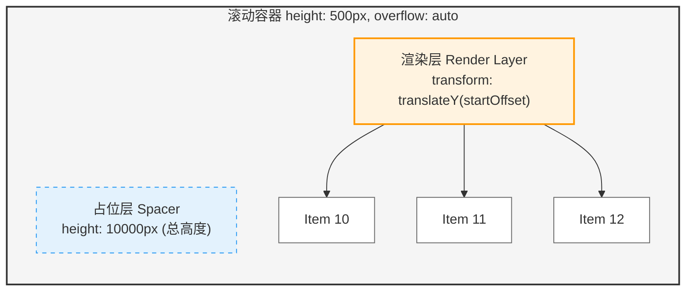
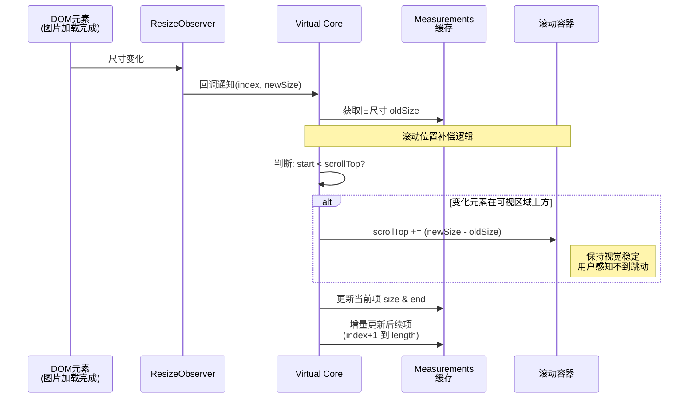
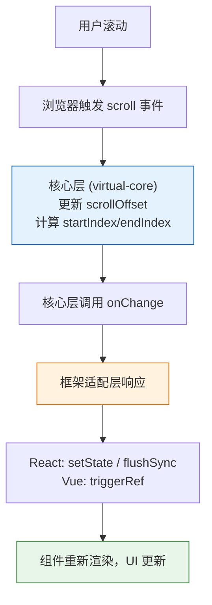

最近在研究 TanStack Virtual 的源码，发现它的设计确实很有意思。这篇文章我想聊聊虚拟列表的核心原理，以及它是如何做到框架无关的。我会从固定高度和动态高度两个场景入手，看看虚拟列表到底是怎么实现的。

为了让大家更容易理解，下面的代码示例我删掉了一些非核心的细节，比如 gap、padding、horizontal 滚动这些配置项的处理逻辑。

## 什么是虚拟列表

当列表项达到数千甚至数万条时，全部渲染会导致页面卡顿、内存占用过高。

### 为什么会卡

每个 DOM 节点都要占内存，浏览器还得计算布局、绑定事件。节点一多问题就来了：

- 1万个节点可能要占用几百MB内存
- 布局计算会很慢
- 滚动的时候要重绘大量节点

虚拟列表的核心思想是：**只渲染可视区域的 DOM，对不可视区的 DOM 不渲染或者部分渲染的技术**。

假设有1万条数据，可视区域高度500px，每项高度50px，那么可视区域最多显示10项。虚拟列表只渲染这10条（加上缓冲区约20条），而不是全部1万条。


### 和传统渲染的对比

| 对比项       | 传统渲染           | 虚拟列表                  |
| ------------ | ------------------ | ------------------------- |
| DOM 节点数   | 全部渲染（10000+） | 只渲染可见部分（10-20个） |
| 首屏渲染时间 | 数秒甚至更长       | 几乎瞬间完成              |
| 内存占用     | 随数据量线性增长   | 保持恒定                  |
| 滚动性能     | 卡顿明显           | 流畅丝滑                  |

## 实现思路

虚拟列表的核心是动态计算可视区域内应该显示哪些列表项：

1. 计算可视区域的起始索引（startIndex）
2. 计算可视区域的结束索引（endIndex）
3. 截取对应的数据进行渲染
4. 计算偏移量（startOffset）让渲染内容对齐可视区域


## 固定高度虚拟列表：最简单的场景

固定高度是虚拟列表最简单的场景，因为每个元素的位置可以通过数学公式直接计算，无需实际测量 DOM。

### HTML 结构

虚拟列表需要三层结构：

```jsx
<div className="container" style={{ height: 500, overflow: "auto" }}>
  {/* 占位层：撑开滚动条 */}
  <div style={{ height: totalHeight }} />

  {/* 渲染层：实际渲染的列表项 */}
  <div style={{ transform: `translateY(${startOffset}px)` }}>
    {visibleData.map((item) => (
      <div key={item.id}>{item.content}</div>
    ))}
  </div>
</div>
```

- **占位层**：高度等于所有列表项的总高度，用来形成正常的滚动条
- **渲染层**：通过 transform 偏移到正确位置



### 核心公式

```javascript
// screenHeight: 可视区域高度，即容器的 clientHeight
// itemSize: 每个列表项的固定高度
// scrollTop: 当前滚动距离，即容器的 scrollTop
// listData: 完整的列表数据数组

// 列表总高度 = 数据总数 × 每项高度
const listHeight = listData.length * itemSize;

// 可视区域能显示的项数 = 可视区域高度 ÷ 每项高度（向上取整，确保填满）
const visibleCount = Math.ceil(screenHeight / itemSize);

// 起始索引 = 滚动距离 ÷ 每项高度（向下取整）
// 向下取整确保不遗漏部分可见的顶部项
const startIndex = Math.floor(scrollTop / itemSize);

// 结束索引 = 起始索引 + 可见数量
const endIndex = startIndex + visibleCount;

// 偏移量 = 起始项的顶部位置 = startIndex × itemSize
// 也可以写成：scrollTop - (scrollTop % itemSize)
const startOffset = startIndex * itemSize;
```

### 为什么用 Math.floor 算 startIndex

举个例子，当 `scrollTop = 120px`，`itemSize = 50px` 时：

- `Math.floor(120/50) = 2`：第2项部分可见，需要渲染
- `Math.ceil(120/50) = 3`：会漏掉第2项，导致顶部出现空白

### 简易版完整实现

```tsx
import React, { useState } from "react";

const VirtualList = ({ listData, itemSize, containerHeight }) => {
  // scrollTop: 当前滚动距离
  const [scrollTop, setScrollTop] = useState(0);

  // 可视区域能显示的项数
  const visibleCount = Math.ceil(containerHeight / itemSize);
  // 列表总高度，用于撑开滚动条
  const listHeight = listData.length * itemSize;
  // 可视区域起始索引
  const startIndex = Math.floor(scrollTop / itemSize);
  // 可视区域结束索引（不超过数据总长度）
  const endIndex = Math.min(startIndex + visibleCount, listData.length);
  // 截取可视区域要渲染的数据
  const visibleData = listData.slice(startIndex, endIndex);
  // 渲染层的偏移量，让第一项对齐到正确位置
  const startOffset = startIndex * itemSize;

  return (
    <div
      // 容器：固定高度，开启滚动
      style={{
        height: containerHeight,
        overflow: "auto",
        position: "relative",
      }}
      // 监听滚动事件，更新 scrollTop
      onScroll={(e) => setScrollTop(e.currentTarget.scrollTop)}
    >
      {/* 占位层：撑开滚动条高度 */}
      <div style={{ height: listHeight }} />
      {/* 渲染层：通过 transform 偏移到正确位置 */}
      <div
        style={{
          position: "absolute",
          top: 0,
          transform: `translateY(${startOffset}px)`,
        }}
      >
        {visibleData.map((item, i) => (
          // 每个列表项固定高度
          <div key={startIndex + i} style={{ height: itemSize }}>
            {item.content}
          </div>
        ))}
      </div>
    </div>
  );
};
```

## 动态高度虚拟列表

实际项目中，列表项高度往往是由内容撑开的，比如长短不一的文本、图片什么的。这时候固定高度的计算公式就不适用了。

### 动态高度的难点

动态高度有几个麻烦的地方：

1. **渲染前不知道实际高度**：元素没渲染到 DOM 前，拿不到真实尺寸，但我们需要知道总高度来显示滚动条
2. **没法用除法算索引**：固定高度时 `startIndex = scrollTop / itemSize`，但动态高度每项都不一样，没法直接算
3. **尺寸变化导致内容跳动**：上方元素高度一变，下方内容位置也跟着变，用户会感觉页面"跳"了一下

### TanStack Virtual 的解决方案

TanStack Virtual 采用**估算 + 测量 + 缓存 + 补偿**的策略：

1. **初始估算**：先用预估高度（estimateSize）初始化所有元素位置，让页面快速显示
2. **实际测量**：元素渲染后，通过 ResizeObserver 获取真实高度
3. **缓存位置**：把测量结果缓存到 measurements 数组，后面直接查
4. **滚动补偿**：上方元素高度变化时，自动调整滚动位置，防止内容跳动

下面我按这四个阶段详细讲讲。

### measurements 数组：位置缓存的核心

在 TanStack Virtual 源码中，使用 measurements 数组来缓存每一项的位置信息：

```typescript
// TanStack Virtual 中每个元素的位置信息
interface VirtualItem {
  index: number; // 元素索引
  start: number; // 元素顶部距离列表顶部的距离
  end: number; // 元素底部距离列表顶部的距离
  size: number; // 元素高度
  // ... 其他属性如 key、lane 等
}

// measurements 数组示例
const measurements: VirtualItem[] = [
  { index: 0, size: 80, start: 0, end: 80 }, // 第0项：高80px，位于 0-80px
  { index: 1, size: 120, start: 80, end: 200 }, // 第1项：高120px，位于 80-200px
  { index: 2, size: 90, start: 200, end: 290 }, // 第2项：高90px，位于 200-290px
  // ...
];
```

有了这个缓存，我们就可以：

- 快速查询任意元素的位置
- 计算列表总高度（最后一项的 end 值）
- 通过二分查找快速定位可视区域

### 阶段一：初始估算——让页面快速显示

#### 为什么需要估算？

在元素渲染到 DOM 之前，我们无法知道它的真实高度。但浏览器需要知道列表的总高度才能显示正确的滚动条。所以我们先用一个预估值来初始化。

```javascript
// estimateSize: 用户提供的预估高度函数，如 () => 80
// 用预估高度初始化所有元素的位置信息
const measurements = listData.map((_, index) => ({
  index,
  size: estimateSize(index), // 预估高度，如 80px
  start: index * estimateSize(index), // 顶部位置 = 索引 × 预估高度
  end: (index + 1) * estimateSize(index), // 底部位置 = (索引+1) × 预估高度
}));

// 基于预估值计算列表总高度
// 例如 1000 项，每项预估 80px，总高度 = 80,000px
const totalHeight = measurements[measurements.length - 1].end;
```

虽然预估不准确，但至少让页面能够快速显示出来，滚动条也能正常工作。

> 估算值越准确，后续调整越少，性能越好。建议基于实际数据统计平均高度作为预估值。

### 阶段二：实际测量——获取真实高度

元素渲染到 DOM 后，我们需要获取它的真实高度来修正 measurements 缓存。

#### 测量时机：回调式 ref 的基本原理

在 DOM 元素挂载或卸载时执行特定逻辑。

**执行时机：**

- 当 DOM 元素挂载到页面时，React 会把这个 DOM 节点作为参数传入回调函数，此时参数 node 是真实的 DOM 元素
- 当 DOM 元素从页面卸载时，React 会传入 null 作为参数，方便你做一些清理工作（比如取消事件监听）

```jsx
// JSX 中为每个元素绑定 ref
<div
  data-index={index} // 通过 data 属性标记索引
  ref={(node) => measureElement(node, index)} // ref 回调进行测量
>
  {item.content}
</div>
```

#### 使用 ResizeObserver 持续监听

TanStack Virtual 用 ResizeObserver 而不是 getBoundingClientRect，原因很简单：

- ResizeObserver 可以持续监听尺寸变化（比如图片加载、内容更新）
- ResizeObserver 是异步回调，不会阻塞主线程
- getBoundingClientRect 只能测一次，还可能触发强制重排

```javascript
// resizeItem: 更新指定索引元素的高度（下一节会详细讲）
const resizeObserver = new ResizeObserver((entries) => {
  entries.forEach((entry) => {
    // 从 data-index 属性获取元素索引
    const index = Number(entry.target.getAttribute("data-index"));
    // 获取元素的真实高度（优先使用 borderBoxSize）
    const measuredHeight = entry.borderBoxSize?.[0]?.blockSize
      ?? entry.contentRect.height;
    // 更新 measurements 缓存
    resizeItem(index, measuredHeight);
  });
});

// measureElement: 在元素挂载时调用
const measureElement = (node: HTMLElement | null, index: number) => {
  if (!node) return;
  // 开始观察该元素的尺寸变化
  resizeObserver.observe(node);
};
```

### 阶段三：增量更新与滚动位置补偿——防止内容跳动



当测量到的真实高度与预估值不同时，需要更新 measurements 缓存。这里有两个关键问题要处理：

#### 问题一：如何高效更新缓存

当第 N 项的高度变化时，第 N+1 项及之后所有项的 start 和 end 都要重新计算。TanStack Virtual 用增量更新：

```javascript
// 假设索引 5000 的元素高度变化
// 只重新计算 5000 之后的项，前面 5000 项的缓存直接复用
for (let i = changedIndex + 1; i < measurements.length; i++) {
  measurements[i].start = measurements[i - 1].end;
  measurements[i].end = measurements[i].start + measurements[i].size;
}
```

变化位置越靠后，需要重算的项越少，性能越好。

#### 问题二：如何防止内容跳动

这是动态 height 最精妙的设计。想象一下这个场景：

1. 用户在看索引 100-110 的内容，scrollTop = 5000px
2. 索引 50 的图片加载完了，高度从 100px 变成 200px（增加了 100px）
3. 索引 51-110 的位置全部下移 100px
4. 用户看到的内容突然"跳"了一下

**解决办法：滚动位置补偿**

如果变化的元素在当前滚动位置上方，我们同时调整 scrollTop，让用户看到的内容保持不变：

```javascript
const resizeItem = (index: number, newSize: number) => {
  const item = measurements[index];
  const oldSize = item.size;
  const delta = newSize - oldSize;  // 高度变化量

  if (delta === 0) return;  // 高度没变，不用处理

  // 关键：判断变化的元素是否在当前滚动位置上方
  // item.start < scrollTop 说明该元素已经滚出可视区域上方
  if (item.start < scrollTop) {
    // 同步调整滚动位置，用户感知不到变化
    containerRef.current.scrollTop += delta;
  }

  // 更新当前项的尺寸
  item.size = newSize;
  item.end = item.start + newSize;

  // 增量更新后续项的位置
  for (let k = index + 1; k < measurements.length; k++) {
    measurements[k].start = measurements[k - 1].end;
    measurements[k].end = measurements[k].start + measurements[k].size;
  }
};
```

效果是这样的：索引 50 高度 +100px → 后续位置全部 +100px → 滚动位置也 +100px → 用户看到的内容相对位置不变。

这就像电梯上升时地板数字在变化，但你站在电梯里感觉不到移动。

### 阶段四：二分查找——快速定位可视区域

固定高度时，我们可以用除法直接算 `startIndex = scrollTop / itemSize`。但动态高度每项都不一样，没法直接算。

**解决办法：** 从 measurements 数组中找第一个 `end > scrollTop` 的项。

#### 为什么是 end > scrollTop

- end 是元素底部的位置
- 如果 end > scrollTop，说明这个元素的底部还没滚出可视区域，也就是该元素至少部分可见
- 这就是可视区域的第一项

**举个例子：** 当 scrollTop = 210px 时：

```javascript
measurements = [
  { index: 0, start: 0, end: 80 }, // end=80 < 210，已完全滚出
  { index: 1, start: 80, end: 200 }, // end=200 < 210，已完全滚出
  { index: 2, start: 200, end: 290 }, // end=290 > 210 ✅ 这是第一个可见项
  { index: 3, start: 290, end: 440 },
];
// startIndex = 2
```

#### 二分查找实现（时间复杂度 O(log n)）

```javascript
const binarySearch = (scrollTop: number): number => {
  let start = 0;
  let end = measurements.length - 1;
  let result = 0;

  while (start <= end) {
    const mid = Math.floor((start + end) / 2);
    // 如果中间项的底部超过 scrollTop，它可能是第一个可见项
    if (measurements[mid].end > scrollTop) {
      result = mid;       // 记录当前结果
      end = mid - 1;      // 继续向左查找，看有没有更靠前的
    } else {
      start = mid + 1;    // 中间项已完全滚出，向右查找
    }
  }
  return result;
};
```

### 缓冲区（overscan）——解决快速滚动白屏

快速滚动时，渲染速度可能跟不上滚动速度，导致短暂白屏。解决办法是在可视区域上下额外渲染几项作为缓冲：

```
┌─────────────────────────┐
│     overscan (5 项)     │  ← 缓冲区上方（已渲染但不可见）
├─────────────────────────┤
│   可视区域 (10 项)      │  ← 用户实际看到的部分
├─────────────────────────┤
│     overscan (5 项)     │  ← 缓冲区下方（已渲染但不可见）
└─────────────────────────┘
```

```javascript
// overscan: 缓冲区大小，TanStack Virtual 默认值为 1
const actualStartIndex = Math.max(0, startIndex - overscan);
const actualEndIndex = Math.min(listData.length, endIndex + overscan);
```

> overscan 建议值：3-5，平衡性能和体验。值太大会增加渲染负担，太小可能出现白屏。

### 完整实现

```tsx
import React, { useState, useEffect, useRef, useCallback } from "react";

interface VirtualItem {
  index: number;
  size: number;
  start: number;
  end: number;
}

interface Props {
  listData: any[];
  estimateSize: number; // 预估高度
  containerHeight: number;
  overscan?: number; // 缓冲区大小
}

const DynamicVirtualList: React.FC<Props> = ({
  listData,
  estimateSize,
  containerHeight,
  overscan = 5,
}) => {
  const [scrollTop, setScrollTop] = useState(0);
  const [listHeight, setListHeight] = useState(0);
  const [, forceUpdate] = useState({});

  const containerRef = useRef<HTMLDivElement>(null);
  const measurementsRef = useRef<VirtualItem[]>([]);
  const scrollTopRef = useRef(0);
  const resizeObserverRef = useRef<ResizeObserver | null>(null);

  // 【阶段一】初始化 measurements，用预估高度填充
  useEffect(() => {
    measurementsRef.current = listData.map((_, i) => ({
      index: i,
      size: estimateSize,
      start: i * estimateSize,
      end: (i + 1) * estimateSize,
    }));
    setListHeight(listData.length * estimateSize);
  }, [listData, estimateSize]);

  // 【阶段三】更新高度（带滚动位置补偿）
  const resizeItem = useCallback((index: number, newSize: number) => {
    const measurements = measurementsRef.current;
    if (!measurements[index]) return;

    const delta = newSize - measurements[index].size;
    if (Math.abs(delta) < 0.5) return; // 忽略微小变化

    // 滚动位置补偿：如果变化的元素在滚动位置上方
    if (
      measurements[index].start < scrollTopRef.current &&
      containerRef.current
    ) {
      containerRef.current.scrollTop += delta;
    }

    // 更新当前项
    measurements[index].size = newSize;
    measurements[index].end = measurements[index].start + newSize;

    // 增量更新后续项
    for (let k = index + 1; k < measurements.length; k++) {
      measurements[k].start = measurements[k - 1].end;
      measurements[k].end = measurements[k].start + measurements[k].size;
    }

    setListHeight(measurements[measurements.length - 1]?.end || 0);
    forceUpdate({});
  }, []);

  // 【阶段二】初始化 ResizeObserver
  useEffect(() => {
    resizeObserverRef.current = new ResizeObserver((entries) => {
      entries.forEach((entry) => {
        const index = Number(entry.target.getAttribute("data-index"));
        if (!isNaN(index)) {
          const height =
            entry.borderBoxSize?.[0]?.blockSize ?? entry.contentRect.height;
          resizeItem(index, height);
        }
      });
    });
    return () => resizeObserverRef.current?.disconnect();
  }, [resizeItem]);

  // 测量元素：在 ref 回调中调用
  const measureElement = useCallback((node: HTMLDivElement | null) => {
    if (node) {
      resizeObserverRef.current?.observe(node);
    }
  }, []);

  // 【阶段四】二分查找起始索引
  const binarySearch = (scrollTop: number): number => {
    const measurements = measurementsRef.current;
    let start = 0,
      end = measurements.length - 1,
      result = 0;
    while (start <= end) {
      const mid = Math.floor((start + end) / 2);
      if (measurements[mid].end > scrollTop) {
        result = mid;
        end = mid - 1;
      } else {
        start = mid + 1;
      }
    }
    return result;
  };

  // 计算可视区域
  const visibleCount = Math.ceil(containerHeight / estimateSize) + 1;
  const startIndex = binarySearch(scrollTop);
  const actualStartIndex = Math.max(0, startIndex - overscan);
  const endIndex = Math.min(
    startIndex + visibleCount + overscan,
    listData.length
  );
  const visibleData = listData.slice(actualStartIndex, endIndex);
  const startOffset = measurementsRef.current[actualStartIndex]?.start ?? 0;

  return (
    <div
      ref={containerRef}
      style={{
        height: containerHeight,
        overflow: "auto",
        position: "relative",
      }}
      onScroll={(e) => {
        scrollTopRef.current = e.currentTarget.scrollTop;
        setScrollTop(e.currentTarget.scrollTop);
      }}
    >
      {/* 占位层 */}
      <div style={{ height: listHeight }} />
      {/* 渲染层 */}
      <div
        style={{
          position: "absolute",
          top: 0,
          transform: `translateY(${startOffset}px)`,
        }}
      >
        {visibleData.map((item, idx) => {
          const actualIndex = actualStartIndex + idx;
          return (
            <div
              key={item.id ?? actualIndex}
              data-index={actualIndex}
              ref={measureElement}
            >
              {item.content}
            </div>
          );
        })}
      </div>
    </div>
  );
};
```

## 框架无关的设计理念

TanStack Virtual 还有个很厉害的特性：**框架无关**。一套核心代码，支持 React、Vue、Angular、Solid 这些主流框架。

### 核心思想：计算与渲染分离

回头看我们前面实现的虚拟列表，核心逻辑其实和 React 没啥关系。

虚拟列表的核心逻辑只依赖几样东西：

- 浏览器原生 API（ResizeObserver、scroll 事件、offsetHeight）
- 纯 JavaScript 数据结构（数组、Map）
- 数学计算（二分查找、位置计算）

这些计算逻辑都是纯 JavaScript，和你用 React 还是 Vue 完全没关系。

那么框架在虚拟列表里扮演什么角色？只有一个：**当数据变化时，触发 UI 重新渲染**。

### 工作原理：onChange 回调



理解框架无关设计的关键在于这张数据流图：

**核心层**完全不知道自己运行在哪个框架中，它只负责：

1. 监听滚动事件
2. 计算可见区域
3. 需要更新 UI 时，调用 onChange 回调

**框架适配层**的唯一职责：实现 onChange 回调，用框架特定的方式触发重渲染。

> 核心层 virtual-core 的 package.json 中 dependencies 为空，不依赖任何框架

### React 适配实现

React 适配层只需要做一件事：核心层调用 onChange 时，触发组件重渲染。

```javascript
function useVirtualizerBase(options) {
  // 技巧：useReducer 返回的 dispatch 每次调用都会触发重渲染
  // () => ({}) 每次返回新对象，确保状态变化
  const rerender = React.useReducer(() => ({}), {})[1];

  const resolvedOptions = {
    ...options,
    // 关键：实现 onChange 回调
    onChange: (instance, sync) => {
      if (sync) {
        // 滚动时需要同步更新，避免闪烁
        flushSync(rerender);
      } else {
        // 尺寸变化等可以异步更新
        rerender();
      }
    },
  };

  // 创建核心层实例（只创建一次）
  const [instance] = React.useState(() => new Virtualizer(resolvedOptions));

  // 每次渲染都更新 options（支持 props 变化）
  instance.setOptions(resolvedOptions);

  // 生命周期：挂载时初始化，卸载时清理
  useIsomorphicLayoutEffect(() => {
    return instance._didMount();
  }, []);

  return instance;
}
```

就这么简单。React 适配层的核心就是：用 useReducer 创建一个强制重渲染的函数，在 onChange 中调用它。

### Vue 适配实现

Vue 适配层的思路一样，只是用 Vue 的方式触发更新：

```javascript
function useVirtualizerBase(options) {
  const virtualizer = new Virtualizer(unref(options));
  // shallowRef：浅响应式，性能更好
  const state = shallowRef(virtualizer);

  watch(
    () => unref(options),
    (options) => {
      virtualizer.setOptions({
        ...options,
        // 关键：实现 onChange 回调
        onChange: () => {
          // triggerRef：手动触发响应式更新
          triggerRef(state);
        },
      });
    },
    { immediate: true }
  );

  onScopeDispose(() => virtualizer._didMount()());
  return state;
}
```

Vue 适配层的核心：用 triggerRef 手动触发 shallowRef 的更新。

### 为什么这样设计

框架无关的好处很明显：

- **维护成本低**：1500 行核心逻辑只维护一份，Bug 修复一次所有框架都受益
- **扩展性强**：适配新框架（比如 Solid、Qwik）只需要写 ~50 行代码
- **可测试性好**：核心层可以脱离框架独立测试

## 总结

回顾一下核心要点：

1. **固定高度**：数学公式直接计算，Math.floor 确保不遗漏部分可见项
2. **动态高度**：估算 → 测量 → 增量更新 → 滚动补偿
3. **缓冲区（overscan）**：上下额外渲染几项，解决快速滚动白屏
4. **框架无关**：核心逻辑和 UI 框架解耦，适配层只负责触发重渲染

## 参考资源

- [TanStack Virtual 官方文档](https://tanstack.com/virtual/latest)
- [TanStack Virtual GitHub](https://github.com/TanStack/virtual)
- [ResizeObserver MDN](https://developer.mozilla.org/en-US/docs/Web/API/ResizeObserver)
